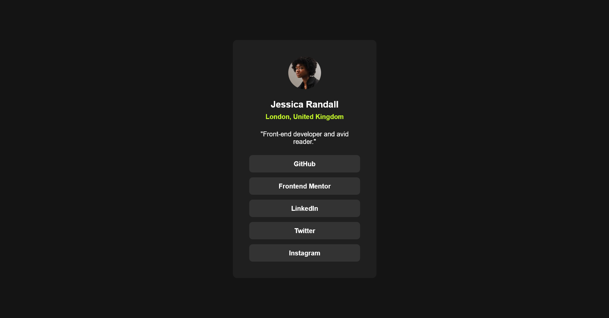
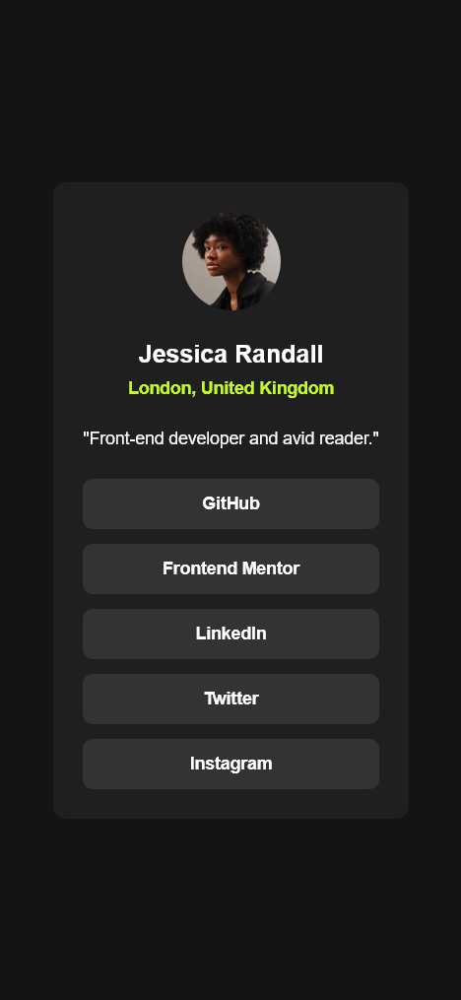
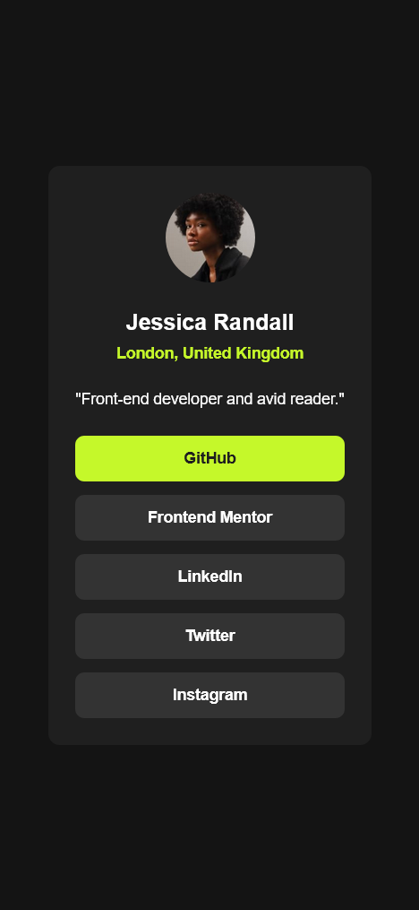
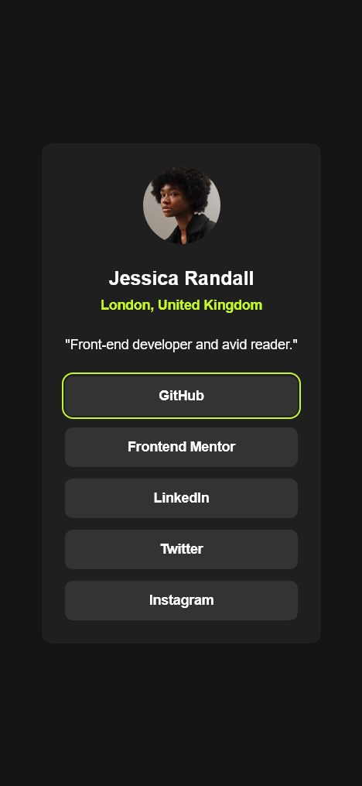

# Frontend Mentor - Social links profile solution

This is my solution to the [Social links profile challenge on Frontend Mentor](https://www.frontendmentor.io/challenges/social-links-profile-UG32l9m6dQ). Frontend Mentor challenges help you improve your coding skills by building realistic projects. 

## Table of contents

- [Overview](#overview)
  - [The challenge](#the-challenge)
  - [Screenshot](#screenshot)
  - [Links](#links)
- [My process](#my-process)
  - [Built with](#built-with)
  - [What I learned](#what-i-learned)
  - [Continued development](#continued-development)
  - [AI Collaboration](#ai-collaboration)
- [Author](#author)

## Overview

### The challenge

Users should be able to:

- See hover and focus states for all interactive elements on the page

### Screenshot

### Links

- Solution URL: [Social links card with semantic HTML and scalable design tokens](https://www.frontendmentor.io/solutions/social-links-card-with-semantic-html-and-scalable-design-tokens-Z7EYtbFspn)
- Live Site URL: [GitHub Pages](https://pauvera.github.io/social-links-profile/)

## My process

I approached this challenge as an intentional exercise in UI Engineering rather than just a small card layout.

Even though the component itself is simple, I wanted to use it as an opportunity to practice semantic HTML, scalable CSS architecture, and design token systems.

One of the first layout decisions I had to make was moving away from an initial flow-based spacing utility that relied on top margins. While that approach worked at first, it became difficult to manage once different groups of elements required distinct spacing relationships.

To solve this, I refactored the layout using Flexbox with `gap`, which gave me much better control over vertical rhythm and made the component more predictable and maintainable.

I also paid special attention to semantic grouping. The user’s name and location required a tighter visual relationship than the rest of the card header, so I introduced a logical wrapper (`.socials-card__persona-info`) to reinforce that hierarchy through spacing.

Another major focus of this project was improving my understanding of design tokens. After receiving feedback in a previous challenge, I intentionally practiced separating primitive tokens (raw values such as colors, font sizes, and spacing units) from semantic tokens (contextual roles such as `--bg-surface` or `--clr-accent`).

This helped me better understand how scalable design systems are structured and why naming tokens by purpose improves maintainability and future theming.

I also used CSS Layers (`@layer`) to keep the stylesheet architecture organized and reduce specificity issues by clearly separating reset styles, tokens, base styles, components, and utilities.

### Built with

- Semantic HTML5
- CSS custom properties
- Primitive and semantic design tokens
- Flexbox
- CSS Layers
- BEM naming convention
- Accessibility best practices
- Mobile-first responsive approach

### What I learned

This project helped me better understand the difference between primitive and semantic design tokens.

Previously, I tended to define variables directly by color name or by very specific component usage. Through this challenge, I practiced separating foundational values from contextual UI roles, which made the stylesheet much easier to reason about.

I also reinforced the idea that layout spacing should be treated as a system rather than as isolated values. Switching from margin-based flow spacing to a `gap`-driven Flexbox structure significantly improved maintainability and visual consistency.

Another important lesson was understanding how semantic grouping in HTML can directly support visual hierarchy and improve the clarity of the layout.

### Continued development

Going forward, I want to continue improving my skills in layout systems, semantic HTML, design systems, and CSS architecture.

I would especially like to keep practicing:
- scalable token systems
- fluid typography with `clamp()`
- responsive spacing strategies
- component-driven CSS architecture
- accessibility-focused UI implementation

My long-term focus is to continue developing skills related to UI Engineering and design system thinking.

### AI Collaboration

AI was used as a learning support tool during this challenge.

I used it primarily to review architectural decisions related to layout, semantic HTML, design tokens, and CSS organization. Rather than requesting direct solutions, I focused on using AI as a feedback and reasoning partner to validate decisions, compare approaches, and refine the maintainability of the final implementation.

This was especially helpful when iterating on the token structure and improving the spacing system from a UI Engineering perspective.

## Author

- Website - [Pau's Github](https://github.com/PauVera) 
- Frontend Mentor - [@PauVera](https://www.frontendmentor.io/profile/PauVera)